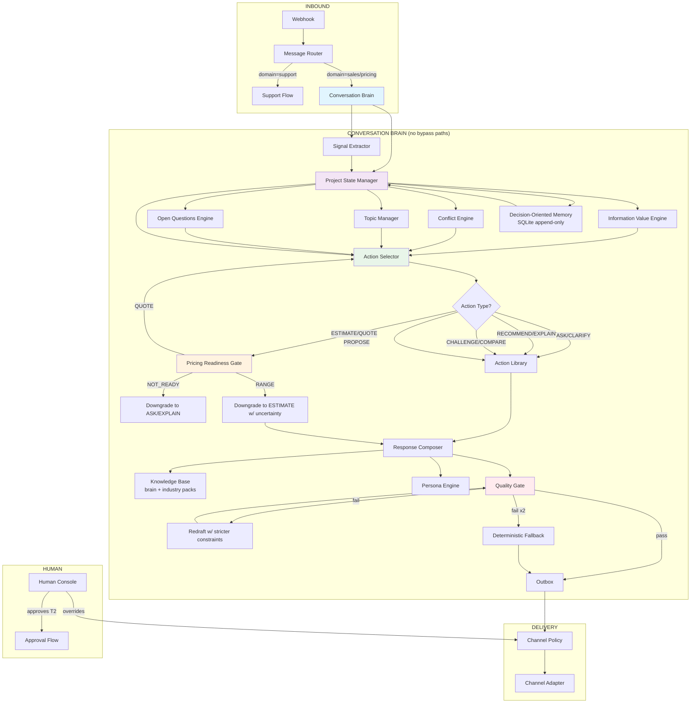

# AmanCore — Target Discovery Engine: Behavioral Specification & Architectural Design

> **Status**: Target architecture specification (pre-implementation).  
> **Based on**: The AmanCore Runtime Architecture & Conversation Behavior Investigation Report (existing codebase, read-only).  
> **Objective**: Design the conversation engine AmanCore *should* use — a senior software architect conducting a genuine consultation, not a form-filling questionnaire.  
> **Constraints**: No code is written. No repository files are modified. This is the behavioral and architectural specification only.

---

## 1. Executive Architecture

### 1.1 Current Problem (Confirmed by Investigation)

The current AmanCore system has two parallel execution paths:

1. **Price-intent shortcut** (`coordinator.py:610`). A broad regex (`_PRICE_INTENT`) matches 16+ price-related words. When matched, the system **immediately** calls `_price_or_proposal_reply()` and returns — completely bypassing RIL, the SalesAgent, the ConversationModel planner, and the QualityGuard (when `scope_under_review` is False, `plan=None` is passed to `_queue_reply`, which skips the guard entirely).

2. **Normal conversation flow** (`coordinator.py:624–746`). A well-structured pipeline: RIL → SalesAgent → ConversationModel planner → LLM draft → QualityGuard → outbox. But this path is **never reached** when the price shortcut fires.

The T1 branch of the price shortcut returns a public starting price range for **any known service category** — with **no owner approval**, **no scope-completeness gate** (Gate-B only applies to T2), and **no QualityGuard validation**.

### 1.2 Target Architecture

```
┌──────────────────────────────────────────────────────────────────────────┐
│                         TARGET DISCOVERY ENGINE                          │
│                                                                          │
│  ┌─────────┐  ┌──────────┐  ┌───────────────┐  ┌──────────────┐        │
│  │ Message │  │ Project  │  │ Information   │  │ Conversa-    │        │
│  │ Router  │→ │ State    │→ │ Value Engine  │→ │ tional       │        │
│  │ (domain)│  │ (rich    │  │ (priority     │  │ Action       │        │
│  │         │  │  model)   │  │  scoring)     │  │ Selector)    │        │
│  └─────────┘  └──────────┘  └───────────────┘  └──────────────┘        │
│       │              │                  │               │               │
│       │              │                  │               │               │
│  ┌────┴─────┐  ┌─────┴─────┐  ┌─────────┴──┐   ┌─────────┴──┐         │
│  │  Memory  │  │ Knowledge │  │ Domain       │   │   Action   │         │
│  │  Layer   │  │  Base     │  │  Framework   │   │  Library   │         │
│  │(decision- │  │ (brain)   │  │  (industry   │   │  (ASK,     │         │
│  │ oriented) │  │           │  │   packs)     │   │  CLARIFY,  │         │
│  └─────────┘  └──────────┘  └───────────────┘   │  EXPLAIN,  │         │
│       │              │                  │       │  ...       │         │
│  ┌────┴─────────────┴──────────┐       │       └────────────┘         │
│  │       Conversation Brain     │       │               │               │
│  │  (state-aware, intent-aware) │       │               │               │
│  └─────────────────────────────┘       │               │               │
│       │                              │               │               │
│  ┌────┴────────────────────────┐     │               │               │
│  │   Pricing Readiness Gate    │←────┘               │               │
│  │  (multi-dimensional score)  │                     │               │
│  └─────────────────────────────┘                     │               │
│       │                                              │               │
│  ┌────┴────────────────────────┐                     │               │
│  │   Response Composer        │←────────────────────┘               │
│  │  (action-aware, context-    │                                     │
│  │   driven brief → LLM)       │                                     │
│  └─────────────────────────────┘                                     │
│       │                                                                │
│  ┌────┴────────────────────────┐                                     │
│  │   Quality Guard              │←──────────────────────────────────┐ │
│  │  (always runs, action-aware) │                                   │ │
│  └─────────────────────────────┘                                   │ │
│       │                                                             │ │
│  ┌────┴────────────────────────┐  ┌──────┐                          │ │
│  │  Outbox                     │→ │Channel│                          │ │
│  │  (delivery policy)          │  │Policy│                          │ │
│  └─────────────────────────────┘  └──────┘                          │ │
└───────────────────────────────────────────────────────────────────┘ │
                                                                        │
   Every message → ───────────────────────────────────────────────────────┘
```

**Core architectural principle**: The price-intent shortcut is **eliminated**. Price requests are normal messages that flow through the **Conversation Brain**. The Brain evaluates pricing readiness as one factor among many and produces a conversational action. Only when the **Pricing Readiness Gate** returns "ready" does the Estimation Engine produce a figure. The QualityGate **always runs** on every reply.

---

## 2. Core Design Principles

| # | Principle | Rationale |
|---|---|---|
| P1 | **No bypass paths** | No regex or keyword can shortcut the Conversation Brain. Every message flows through state evaluation, information-value prioritization, and quality gating. |
| P2 | **Action-over-question** | The system selects from a menu of conversational actions (ASK, EXPLAIN, RECOMMEND, CHALLENGE, etc.), not just "ask next question." |
| P3 | **Project model as source of truth** | All decisions derive from a structured Project Understanding Model, not from a flat facts dict. |
| P4 | **Information value drives priority** | Questions and discussions are selected by impact on scope, architecture, risk, and pricing — not by which field was least recently filled. |
| P4.5 | **Price request ≠ end of discovery** | A price question triggers a readiness check. If not ready, the system explains what's unknown and continues discovery. |
| P5 | **Requirement lifecycle** | Every piece of project knowledge has a status (UNKNOWN→MENTIONED→CONFIRMED→…), a history, a source message, and a reason. |
| P6 | **Conflict preservation** | Contradictions create explicit conflict records with history, not silent overwrites. |
| P7 | **Deterministic guardrails, LLM guidance** | Pricing math, approval gates, state persistence, and quality rules are deterministic. LLM handles interpretation, recommendation, and dialogue. |
| P8 | **Decision-oriented memory** | Memory preserves decisions with their rationale, not just raw transcript fragments. |
| P9 | **One meaningful interaction** | The system prefers one focused action per turn, escalating to multi-part only when justified by information value. |
| P10 | **Customer decides business, architect decides technical** | The system autonomously resolves technical choices and only asks business decisions from the customer. |

---

## 3. Target Discovery Engine

### 3.1 High-Level Flow

```
Customer message
    ↓
Message Router (domain classification: support / sales / pricing / unrelated)
    ↓
Conversation Brain
    ├─ Load Project State
    ├─ Extract facts + detect signals from message
    ├─ Update Project Model (with lifecycle tracking)
    ├─ Detect conflicts / scope changes / topic switches
    ├─ Evaluate Open Questions (what must be asked?)
    ├─ Compute Information Value of all unresolved items
    └─ Select Conversational Action (ASK / EXPLAIN / RECOMMEND / etc.)
    ↓
Pricing Readiness Gate (if action is ESTIMATE or QUOTE)
    ├─ Scope confidence ≥ threshold?
    ├─ Required domains covered?
    ├─ No unresolved critical conflicts?
    └─ Return: NOT_READY / RANGE | ESTIMATE | QUOTE
    ↓
Response Composer (deterministic base → LLM wording)
    ├─ Action-aware brief injection
    ├─ Context window management (decision-oriented)
    └─ LLM drafts response in the customer's persona
    ↓
Quality Gate (always runs)
    ├─ Validate action consistency
    ├─ Check for hallucinated numbers
    ├─ Verify no forbidden claims
    └─ Enforce conversational budget
    ↓
Outbox (delivery)
    └─ Channel policy: allow / hold / handoff
```

### 3.2 Conversation Brain (core orchestrator)

| Component | Responsibility |
|---|---|
| **Project State Manager** | Load/save the Project Understanding Model. Track requirement lifecycle. Manage conflicts. |
| **Signal Extractor** | Deterministic + LLM-assisted extraction of facts, intents, contradictions, scope changes, topic shifts from the raw message. |
| **Information Value Engine** | Score every unresolved requirement, question, and decision point by impact dimensions. Select the highest-value discussion. |
| **Action Selector** | Choose the conversational action (ASK, CLARIFY, EXPLAIN, RECOMMEND, COMPARE, CONFIRM, CHALLENGE, etc.) based on context. |
| **Topic Manager** | Track main topic, side topics, queued topics, deferred topics. Handle interruptions and returns. |
| **Readiness Engine** | Evaluate whether the project model is ready for estimation, proposal, or quote. Produce multi-level readiness signal. |
| **Persona Engine** | Ensure responses match the senior consultant persona (experienced, calm, professional). |

### 3.3 What is eliminated

| Current Component | Why eliminated | Replacement |
|---|---|---|
| `_PRICE_INTENT` regex shortcut | Causes premature pricing, bypasses discovery | Price as normal message → routed through Conversation Brain → Readiness Engine |
| `DiscoveryEngine.next_question` (PRIORITY list) | Rigid questionnaire behavior | Information Value Engine + Action Selector |
| `ModeManager` (single state machine) | Too coarse for consultation nuance | Multi-layer: Persona Mode + Phase + Action + Topic state |
| T1 band without approval | Returns price with minimal context | Pricing Readiness Gate: RANGE only when ≥2 readiness criteria met, never a raw band on category alone |
| `open_questions` stored but never asked | Forgotten clarifications | Open Questions Engine: persistent queue, prioritized, must ask |

---

## 4. Conversational Action Model

The system selects ONE primary action per turn (with optional secondary context). Each action is a deliberate consultant behavior, not a form-filling step.

### Action definitions

| Action | Purpose | Trigger Conditions | Required Context | Expected Output | Changes State? | Can Be Followed By | Can Precede Pricing? |
|---|---|---|---|---|---|---|---|
| **ASK** | Gather specific information | Information Value Engine selects a high-impact unknown | Project model with at least minimal context | One focused question | Yes (marks field as queried) | Any | YES — but only if the question is about a non-pricing-critical area |
| **CLARIFY** | Resolve ambiguity without new info | Customer statement is ambiguous (multiple interpretations) | Ambiguous extraction result | Rephrase understanding + request confirmation | Yes (adds to open questions) | Any | YES |
| **EXPLAIN** | Educate about a concept | Customer asks technical/business question; system has relevant knowledge | Domain knowledge + project context | Simple explanation in customer's language | No (unless clarification follows) | Any | YES |
| **RECOMMEND** | Propose a solution | Information Value Engine identifies a decision point; system has a domain-backed recommendation | Project model + domain knowledge | Recommendation + reason + confirmation prompt | Yes (proposes a decision) | CONFIRM, CHALLENGE, PROPOSE | YES — always (recommendation ≠ price) |
| **COMPARE** | Weigh options | Multiple viable paths exist; tradeoff is significant | 2+ options with known tradeoffs | Comparison table (simplified) + recommendation | No | PROPOSE, CONFIRM | YES |
| **CONFIRM** | Lock in a decision | A recommendation was made and customer hasn't objected | Pending recommendation | Summary of what was decided + next step | Yes (moves requirement to CONFIRMED) | Any | YES |
| **CHALLENGE** | Question a problematic request | Requirement violates best practice, raises risk, or contradicts earlier info | Risk model + project context | "I'd suggest considering…" + alternative | Yes (adds constraint/risk note) | RECOMMEND, PROPOSE | YES |
| **SUMMARIZE** | Recap progress | Conversation is long, or transitioning phases, or returning from interruption | Full project state | Brief recap of decisions + open items | No | Any | YES |
| **EXPLORE** | Broad discovery when little is known | Very early; customer has vague idea; few facts extracted | Minimal context | Open-ended question + suggestion of directions | Yes (populates context) | ASK, EXPLAIN, RECOMMEND | YES |
| **PROPOSE** | Present a structured plan | Readiness Engine indicates scope is sufficient | Project model with good coverage | Structure proposal (sections/features) | Yes (locks proposed scope) | CONFIRM, CHALLENGE, ASK | YES |
| **DECOMPOSE** | Break down a complex requirement | Requirement has high complexity/conflict | Complex requirement identified | Sub-requirements + tradeoffs | Yes (creates child requirements) | ASK, CHALLENGE | YES |
| **PRIORITIZE** | Sequence uncertain backlog | Multiple undecided features | Feature list with dependencies | Priority ordering + rationale | Yes (updates phase assignments) | PROPOSE, ASK | YES |
| **VALIDATE** | Check assumptions | System has made assumptions that affect scope | Assumptions list | "I'm assuming X — is that right?" | Yes (confirms/refutes assumption) | Any | YES |
| **CONTINUE_DISCOVERY** | Keep conversation flowing | No high-value action identified; customer is engaged | Minimal context | Light acknowledgment + soft redirect | No | Any | YES |
| **ESTIMATE** | Give preliminary cost | Readiness Engine returns RANGE or ESTIMATE level | Sufficient scope for estimate (not full readiness) | Range with uncertainty bands | Yes (locks estimate context) | QUOTE | N/A — this IS estimation |
| **QUOTE** | Present final price | Readiness Engine returns QUOTE level | Full scope confidence + no critical conflicts | Fixed price + terms | Yes (locks commercial state) | NEGOTIATION, HANDOFF | N/A — pricing IS the action |
| **HANDOFF** | Escalate to human | Price objection, high complexity, customer request | Objection detected or explicit request | Acknowledge + "transferring to specialist" | Yes (handover state) | (human takes over) | YES — but only via HANDOFF, not price shortcut |

### Action composition rules

- **Primary action**: Exactly one primary action per turn (e.g., ASK, RECOMMEND).
- **Secondary context**: Optional supporting action (e.g., ASK + brief context, RECOMMEND + CHALLENGE edge case).
- **No price without readiness**: ESTIMATE and QUOTE can ONLY be produced by the Response Composer when the Pricing Readiness Gate explicitly returns a positive signal. No action that is not ESTIMATE/QUOTE can produce a figure.

---

## 5. Project Understanding Model

The Project Understanding Model is the single source of truth for the consultation. It is stored as structured JSON in the CRM `conversations` table (replacing the current flat `facts` + `working_memory` split).

### 5.1 Top-level structure

```json
{
  "project_id": "proj_xxx",
  "metadata": {
    "created_at": "ISO",
    "last_updated": "ISO",
    "channel": "whatsapp",
    "language": "ar",
    "lead_id": "lead_xxx",
    "conversation_id": "conv_xxx"
  },
  "business_context": { ... },
  "requirements": [ ... ],
  "structure": { ... },
  "commercial": { ... },
  "discovery_state": { ... },
  "topic_state": { ... },
  "history": [ ... ],
  "decisions": [ ... ],
  "conflicts": [ ... ],
  "open_questions": [ ... ],
  "assumptions": [ ... ],
  "scope_summary": { ... }
}
```

### 5.2 Business Context

Captures the business reality behind the project. Not extracted as rigid fields but as a structured understanding.

```
business_context:
  industry:                string            # detected or stated (ecommerce, restaurant, etc.)
  business_model:          enum              # marketplace, SaaS, B2C, B2B, marketplace, etc.
  business_problem:        text              # what pain are they solving?
  desired_outcome:         text              # what does success look like?
  target_audience:         { type, description }
  decision_maker:          { role, authority_level }
  budget_tier:             enum              # not a number — a tier (bootstrap, growth, enterprise)
  urgency:                 enum              # exploratory | urgent | flexible
```

### 5.3 Requirements

Each requirement is an **object**, not a key-value pair.

```
requirements: list<{
  id:               uuid,
  field:            string,                 # e.g., "payment_method", "platform", "feature_set"
  label:            string,                 # human-readable: "Payment gateway"
  category:         string,                 # payments, platform, features, etc.
  criticality:      enum<core | important | nice_to_have>,
  pricing_impact:   enum<high | medium | low>,     # impact on price if known
  architecture_impact: enum<high | medium | low>,  # impact on architecture
  workflow_impact:  enum<high | medium | low>,
  risk_impact:      enum<high | medium | low>,
  dependencies:     [requirement_id, ...],  # must be decided before this
  unlock:           [requirement_id, ...],  # knowing this unlocks these
  status:           enum,                   # see Section 6
  confidence:       float,                  # 0.0–1.0 (for inferred/assumed)
  value:            any,                    # the actual value (e.g., "stripe", true, "2025-Q2")
  source:           { message_id, turn, type: customer|extracted|llm_inferred|assumed|recommended },
  reason:           text,                   # WHY this value / status
  history:          [ { status, value, reason, at, message_id } ],
  phase:            enum<MV | PHASE_2 | PHASE_3 | FUTURE | NOT_RECOMMENDED>,
  hidden_from_price: boolean                 # if True, knowing this does NOT change price
}>
```

### 5.4 Structure (decomposed project)

The system decomposes the project into logical building blocks, not just flat fields.

```
structure:
  user_roles:        [{ name, description, permissions }]
  workflows:         [{ name, actors, steps, complexity }]
  modules:           [{ name, description, dependencies, phase }]
  integrations:      [{ name, type, criticality, reason }]
  platforms:         [{ platform, priority, reason }]
  payments:          [{ method, provider, flow, criticality }]
  notifications:     [{ channel, triggers, provider }]
  admin:             [{ capability, scope, complexity }]
  content:           [{ type, source, frequency }]
  data:             { entities, relationships, flow }
  security:         { auth_model, data_protection, compliance }
  scalability:      { expected_load, growth, architecture_notes }
  localization:     { languages, locales, complexity }
```

### 5.5 Commercial

```
commercial:
  budget:           { tier, range, currency, flexibility }
  timeline:         { target, flexibility, urgency }
  approval_process: { decision_maker, threshold, process }
  pricing_expectation: enum<unknown | range | specific | budget_constrained>
  last_estimate:    { amount, confidence, basis, timestamp }
  quotes:           [ { version, amount, scope_snapshot, approved, timestamp } ]
```

### 5.6 Discovery State

```
discovery_state:
  phase:            enum<OPENING | DISCOVERY | SHAPING | VALIDATION | 
                      SCOPE_READY | ESTIMATION | COMMERCIAL>,
  persona_mode:     enum<CONSULTATIVE | GUIDANCE | HANDOFF>,
  current_action:   string,               # last action taken
  last_action_at:   ISO,
  last_message_id:  string,
  scope_confidence: float,                # 0.0–1.0, multi-dimensional
  info_value_next:  { requirement_id, reason, score },
  pending_validations: [ { type, requirement_id, reason } ],
  assumptions_active: integer            # count of unvalidated assumptions
```

### 5.7 Topic State

```
topic_state:
  main_topic:       string,               # primary service/project
  active_topic:     string,
  topic_stack:      [ { topic, depth, question_pending } ],
  queued_topics:    [ { topic, reason, priority } ],
  deferred_topics:   [ { topic, reason, at_turn } ],
  completed_topics:  [ { topic, completed_at } ]
```

### 5.8 History (append-only)

```
history: list<{
  turn: integer,
  message_id: string,
  speaker: enum<customer|assistant>,
  action_taken: string,          # ASK, RECOMMEND, EXPLAIN, etc.
  requirement_id: string | null,
  summary: string,               # one-line summary of what happened
  timestamp: ISO
}>
```

**This history is NEVER overwritten.** It is the audit trail for all state changes.

---

## 6. Requirement Lifecycle

### 6.1 Status states

| Status | Meaning | Who can create it | Who can change it | Influences pricing? | Must show customer? |
|---|---|---|---|---|---|
| **UNKNOWN** | System has no knowledge of this requirement | System (default) | System | No | No |
| **MENTIONED** | Customer mentioned it but value not confirmed | Signal Extractor | System, Customer | No (value unknown) | Maybe (acknowledged) |
| **INFERRED** | System derived it from other facts | Signal Extractor (LLM) | System, Customer | Potentially (if high confidence) | Maybe |
| **ASSUMED** | System assumes a default value pending confirmation | Conversation Brain (assumption engine) | System, Customer | No (treated as non-binding until confirmed) | Yes (must validate) |
| **RECOMMENDED** | System proposes a specific value with rationale | Recommendation Engine | System, Customer | No (proposal, not decision) | Yes |
| **PROPOSED** | System proposes structure that includes this requirement | Response Composer (PROPOSE action) | System, Customer | Potentially | Yes |
| **CONFIRMED** | Customer explicitly agreed | Customer (via CONFIRM action or affirmative reply) | Customer | YES | Yes |
| **REJECTED** | Customer explicitly declined | Customer | Customer | No (excluded) | Yes (if relevant context) |
| **CONFLICTING** | Two incompatible values stated | Conflict Engine | System | No (blocked) | Yes (must resolve) |
| **DEFERRED** | Decision postponed to later phase | System | System, Customer | No (future scope) | Maybe |
| **FUTURE_SCOPE** | Explicitly for future phase | System | System, Customer | No | Maybe |
| **MVP** | Included in minimum viable product | System | System, Customer | YES | Yes |
| **PHASE_2** | Scheduled for phase 2 | System | System, Customer | No (deferred) | Maybe |
| **PHASE_3** | Scheduled for phase 3 | System | System, Customer | No (deferred) | Maybe |
| **OBSOLETE** | Superseded by a later decision | Conflict Engine / Change Engine | System | No (excluded) | No |

### 6.2 Lifecycle transitions

```
UNKNOWN
   ↓ (mentioned in message)
MENTIONED
   ↓ (LLM infers from other facts)
INFERRED
   ↓ (system assumes default)
ASSUMED
   ↓ (recommendation engine proposes)
RECOMMENDED
   ↓ (system proposes structure containing it)
PROPOSED
   ↓ (customer affirms)
CONFIRMED ←→ REJECTED (two-way: customer can flip)
   ↓ (contradicted by later message)
CONFLICTING
   ↓ (customer resolves)
CONFIRMED / REJECTED
   ↓ (customer defers)
DEFERRED
   ↓ (phase assignment)
PHASE_2 / PHASE_3 / FUTURE_SCOPE
   ↓ (superseded)
OBSOLETE
```

**Key design**: Every transition is recorded in `requirement.history` with the reason, source message, and timestamp. No silent overwrites.

### 6.3 Who can change status

- **System** (Signal Extractor): MENTIONED, INFERRED, ASSUMED, PROPOSED
- **System** (Recommendation Engine): RECOMMENDED
- **Customer** (explicit affirmation/decline): CONFIRMED, REJECTED
- **System** (Conflict Engine): CONFLICTING, OBSOLETE
- **System** (Phase Engine): MVP, PHASE_2, PHASE_3, FUTURE_SCOPE
- **Customer** (deferral): DEFERRED

### 6.4 Pricing influence by status

- **Does NOT influence pricing**: UNKNOWN, MENTIONED, INFERRED, ASSUMED, REJECTED, CONFLICTING, OBSOLETE, DEFERRED, PHASE_2, PHASE_3, FUTURE_SCOPE
- **May influence pricing (with caveat)**: INFERRED (only if confidence > 0.8), ASSUMED (only in non-final estimate)
- **Does influence pricing**: CONFIRMED, PROPOSED, MVP, RECOMMENDED (only if customer explicitly accepts)

---

## 7. Information Value / Priority Engine

### 7.1 Scoring dimensions

Every unresolved (not CONFIRMED, not REJECTED, not OBSOLETE) requirement is scored across dimensions:

| Dimension | Range | Meaning |
|---|---|---|
| **pricing_impact** | 0–10 | How much does this value's uncertainty affect the price estimate? |
| **architecture_impact** | 0–10 | How much does this affect the technical architecture? |
| **workflow_impact** | 0–10 | How much does this affect the business workflows? |
| **risk_impact** | 0–10 | How much does uncertainty here increase project risk? |
| **dependency_count** | 0–N | How many other unresolved requirements depend on this? |
| **unlock_count** | 0–N | How many other requirements would be unblocked by knowing this? |
| **customer_effort** | 0–10 | How hard is it for the customer to answer? (lower = easier) |
| **urgency** | 0–10 | How time-sensitive is this? (e.g., timeline, payment model) |

### 7.2 Composite scoring formula

```
priority_score = (
    pricing_impact × w_price +
    architecture_impact × w_arch +
    risk_impact × w_risk +
    dependency_count × w_dep +
    unlock_count × w_unlock −
    customer_effort × w_effort +
    urgency × w_urgent
)

# Default weights (configurable per domain):
w_price   = 0.25  # highest — price questions matter most
w_arch    = 0.20
w_risk    = 0.15
w_dep     = 0.10
w_unlock  = 0.10
w_effort  = -0.05  # NEGATIVE: easy questions should be asked more
w_urgent  = 0.05
```

The requirement with the highest `priority_score` becomes the next discussion point.

### 7.3 Dependency relationships

Requirements can declare:
- `dependencies`: requirements that must be resolved before this one.
- `unlocks`: requirements that become answerable once this is known.

Example: `payment_model` depends on `business_model` (you can't choose payment flow without knowing the business model) but unlocks `checkout_architecture`, `integration_complexity`, and `pricing_tier`.

### 7.4 Why this replaces weighted missing fields

The current system uses `question_weights[category]` (e.g., `key_features: 9, integrations: 8, ...`). This is a **static priority** — the same category always asks the same fields in the same order. The Information Value Engine is **dynamic**:

- Weights depend on what's already known (dependencies, unlocks).
- Impact scores are multi-dimensional, not a single number.
- The engine considers customer effort (don't ask hard questions early).
- It considers urgency (timeline is urgent but might be easy to answer).

---

## 8. Question Strategy

### 8.1 Single vs. multiple questions

**Default rule: ONE focused question per turn.** This is enforced by the Action Selector: only one ASK, CLARIFY, or CONFIRM action per response.

**Exceptions** (the rule can be broken when justified):
- The Information Value Engine identifies 2+ requirements with `priority_score` > 80 AND low `customer_effort` (≤3) AND shared dependency. → Bundle as "related questions."
- SUGGEST-INTAKE (delegation mode): present 2-3 quick-choice options in ONE question. → Multiple sub-questions in one turn is permitted when each is trivial (yes/no, choice from 2-4 pre-defined options).
- The customer asks a compound question: "Do you need X or Y?" → the system can address both, but each as a separate CONFIRM or RECOMMEND, not a shotgun survey.

### 8.2 When to ask vs. explain vs. recommend

| Situation | Action | Rationale |
|---|---|---|
| High-value unknown, customer can answer | ASK | Directly resolve the highest-priority gap |
| Customer's intent is ambiguous | CLARIFY | Before investing effort, confirm interpretation |
| Customer asks "how" or "why" | EXPLAIN | Educate to build trust |
| Customer is uncertain / delegates | RECOMMEND + CONFIRM | Provide guidance, not a void |
| Requirement has conflicting values | CLARIFY | Must resolve before proceeding |
| Low-value unknown blocks high-value known | ASK (but acknowledge) | "Quick check on X so I can give you a better Y recommendation" |
| Multiple valid paths exist | COMPARE | Present tradeoff explicitly |
| Customer overwhelmed | EXPLORE → RECOMMEND | Guide, don't interrogate |

### 8.3 Contextual follow-up

The system tracks the **last 3 conversation turns** in context. When asking a follow-up:
- If the previous customer answer mentioned concept X, the question can reference it: "You mentioned X — for X, do you need Y or Z?"
- The Information Value Engine boosts questions that are unlocked by the previous answer.

This is enabled by the `unlocks` relationship on requirements: when requirement A is confirmed, all requirements in A's `unlock` list get their `priority_score` recalculated and boosted.

---

## 9. Customer Who Does Not Know What They Want

### 9.1 Detection

The system detects delegation/uncertainty via:

```
suggestion_triggers (expanded set):
  "أنا لا أدري" / "ما أعرف" / "اقترح لي" / "أنت تعرف" / "عليك الاختيار" /
  "you decide" / "whatever you think" / "I'm not sure" / "I don't know" /
  "just make it simple" / "I trust your expertise" / "you're the expert"
```

Plus sentiment detection: `uncertain`, `hesitant`, `delegating`.

### 9.2 Behavior

When uncertainty is detected, the system transitions to **GUIDANCE** persona mode and follows this pattern:

```
EXPLAIN the choice in simple terms
→ PRESENT 2-3 options with tradeoffs
→ RECOMMEND one
→ CONFIRM with the customer
```

Example:

```
Customer: "I don't know whether I need an app."

System (RECOMMEND):
"Here's the decision in simple terms:
• Web-only MVP: lower cost, faster launch, validates demand. Mobile can be added in 2-3 months.
• Web + app: higher cost, longer timeline, but users get mobile immediately.

Given you want to validate the market first, I recommend the web MVP with a mobile-ready backend.
Does that approach work for you?"
```

### 9.3 Mechanism

- The **Confidence Engine** sets a flag: `decision_mode = "customer_uncertain"`.
- The **Action Selector** overrides normal ASK behavior with RECOMMEND + CONFIRM.
- The **Persona Engine** shifts tone to more explanatory, less interrogative.
- Once the customer confirms or declines, `decision_mode` resets to normal and the system returns to information-value-driven discovery.

### 9.4 Why this is different from the current system

The current SUGGEST-INTAKE only asks easy-choice questions (e.g., "delivery: yes/no"). The target system **explains the tradeoff** and **recommends** based on context, then gets confirmation. The recommendation is grounded in the domain framework (MVP principles, phased delivery rules).

---

## 10. Technical Consulting Behavior

### 10.1 Persona definition

The AI persona is: **experienced, calm, professional, technically competent, honest, consultative, not pushy, not robotic, not overly verbose, business-aware.**

This is enforced by:
- A **Persona Engine** that adjusts tone, vocabulary, and pacing based on `persona_mode` (CONSULTATIVE, GUIDANCE, HANDOFF).
- **Persona rules** in the action briefs (e.g., "use the EXPLAIN action: translate technical implications to business language in one sentence").
- **Response Composer** constraints (max 3 short paragraphs, never jargon without translation).

### 10.2 Technical explanation pattern

When the customer asks a technical question:

```
Customer: "What server do you recommend?"

System (EXPLAIN):
"That depends on what we build. For a web-first MVP, I'd go with a 
managed serverless setup (AWS Lambda or Vercel) — it handles 
scaling automatically and you only pay for usage. That means 
faster launch and lower upfront cost.

When we scope the full features, I'll finalize the exact stack. 
For now, the key thing you decide is: web MVP, mobile-included, or 
both-at-once."
```

Pattern: **Business implication → technical detail → simple recommendation → tie back to business decision.**

### 10.3 What NOT to do

- Do NOT ask "PostgreSQL or MySQL?" unless it materially affects price or risk.
- Do NOT explain architecture unless asked.
- Do NOT overwhelm with options. Translate one technical concept per response.

### 10.4 When to explain proactively

- When the customer's request implies a technical tradeoff (e.g., "I want real-time chat" → EXPLAIN the scaling implications).
- When a confirmed requirement has technical consequences the customer may not know (e.g., "multi-currency" → EXPLAIN payment gateway complexity).
- When challenging a requirement (CHALLENGE action) — the explanation IS the challenge.

---

## 11. Trade-Off Engine

### 11.1 When it activates

The Trade-Off Engine activates when:
1. Multiple architectural paths are viable for a confirmed requirement.
2. The Information Value Engine flags a tradeoff decision as high-impact.
3. The customer asks "should I…" or "compared to…" or "advantage of…".

### 11.2 Output format

```
COMPARE action:
"Two options here:

Option A — [name], benefits: [list 2-3], tradeoffs: [list 1-2]
Option B — [name], benefits: [list 2-3], tradeoffs: [list 1-2]

For your context ([reasoning]), I recommend Option A.

Which direction feels right?"
```

### 11.3 Tradeoff scoring dimensions

Each option is scored on:
- **Cost**: relative initial investment
- **Speed**: time to launch
- **Risk**: technical complexity, failure modes
- **Scalability**: growth ceiling
- **Maintenance**: ongoing effort
- **Future flexibility**: ability to change later

### 11.4 Integration with estimation

When the Trade-Off Engine produces an estimate, it tags each number with its **uncertainty band**:
```
Option A: $12K–$18K (est. range, ±30% — payment model unconfirmed)
Option B: $18K–$28K (est. range, ±25% — real-time features scope pending)
```

**No final quote** is given until all high-uncertainty inputs are CONFIRMED.

---

## 12. MVP / Phased Delivery Engine

### 12.1 What gets phased

The engine assigns features to phases based on:
- **Validation value**: does the customer need this to prove the concept?
- **Dependency chain**: features that others depend on go first.
- **Cost**: expensive features for future phases.
- **Risk**: features with technical risk can be deferred or de-risked first.

### 12.2 The MVP rule

A feature is in the **MVP** if:
1. It serves the core workflow (must-have for business model to function).
2. It has low-risk implementation.
3. Removing it would invalidate the MVP's purpose.
4. The customer's budget tier supports at least the MVP scope.

**A feature is NOT MVP if**:
- It's nice-to-have (customer won't lose core purpose without it).
- It has high technical risk.
- It depends on something not in the MVP.
- It significantly increases cost without proportional validation value.

### 12.3 Phase assignment communication

```
"For the MVP, I'd recommend:
✓ [core features] — needed to launch
○ [Phase 2 features] — important but not launch-blocking
△ [Phase 3 features] — future enhancements

This gives you a working product in [timeline] while keeping initial
cost in the $[range] range. The platform is built to accept all
future features without refactoring."
```

### 12.4 Challenge integration

When the customer asks for everything (25 features), the engine:
1. Maps each to a workflow or module.
2. Runs dependency + cost analysis.
3. Produces MVP + Phase 2 + Phase 3 breakdown.
4. **CHALLENGE**: "Including all 25 in v1 would push scope to X and timeline to Y. Here's a phased approach that delivers value faster."

---

## 13. Conflict & Change Management

### 13.1 What constitutes a conflict

A conflict occurs when:
1. A confirmed requirement is later contradicted (e.g., "I want booking" → "Actually no booking").
2. A new requirement conflicts with an existing confirmed one (e.g., "I want Stripe" → "Actually PayPal").
3. A scope change materially invalidates a previous estimate or proposal.

### 13.2 Conflict detection

The **Conflict Engine** runs after every message:
1. Extract new facts.
2. Compare against confirmed requirements with the same `category`.
3. If values differ → create a `conflict` record.

### 13.3 Conflict record structure

```json
{
  "conflict_id": "uuid",
  "requirement_id": "req_xxx",
  "old_value": "booking: true",
  "new_value": "booking: false",
  "message_id": "msg_yyy",  // the message that introduced the conflict
  "previous_message_id": "msg_zzz",  // where old value was confirmed
  "detected_at": "ISO",
  "status": "UNRESOLVED | RESOLVED",
  "resolution": "new_value_kept | old_value_kept | customer_chose_new | customer_kept_old",
  "customer_confirmed_at": "ISO",
  "impact": "low | medium | high"  // on price, scope, architecture
}
```

### 13.4 Change handling

When a conflict is detected:
1. **CLARIFY** action: "Earlier you mentioned X. Now you're saying Y. Can you confirm which direction you want?"
2. The old value is marked `OBSOLETE` (NOT silently overwritten).
3. If the new value is confirmed, the conflict is marked `RESOLVED` with resolution noted.
4. If the conflict affects price, the **Pricing Readiness Gate** is re-evaluated. A changed requirement invalidates any previous estimate or quote.

### 13.5 Scope change → quote invalidation

When a requirement with `pricing_impact >= 7` changes:
- The old estimate/quote is **superseded** (not deleted — marked `superseded_by: new_quote_id`).
- A new estimate is required when the customer next asks for price.
- The system explains: "Since we changed [X], the previous estimate no longer applies. I'll provide a fresh one when we're ready."

**This is the key improvement over the current `_update_scope_review`** which only blocks numbers during `scope_under_review` — it doesn't preserve history or invalidate old estimates.

---

## 14. Open Questions Engine

### 14.1 The "forgot to ask" problem

The current system stores `open_questions` in `merge_facts` but **never surfaces them** in the conversation. The Open Questions Engine fixes this.

### 14.2 Open Question lifecycle

```
CREATED → PRIORITIZED → ASKED → ANSWER_PENDING → ANSWER_RECEIVED → CLOSED
                                     ↘ (customer defers) → DEFERRED
                                     ↘ (superseded) → SUPERSEDED
```

### 14.3 Priority calculation

Each open question's priority = the `priority_score` of the requirement it concerns (from the Information Value Engine), plus:
- +10 if it's a dependency for 3+ other requirements
- +5 if it's been open for >2 turns
- -5 if customer just deferred it (don't re-ask immediately)

### 14.4 Enforcement

- **Every turn**, the Action Selector checks: "Are there open questions with priority > 70?" If yes, one is selected as the ASK action — **even if the Information Value Engine picked a different action**. This ensures critical clarifications are never forgotten.
- Open questions are **persisted** in the project model with their priority score and age.
- When a question is asked, it's marked `ASKED` with the turn number. If the customer doesn't answer it directly, it stays `ANSWER_PENDING`.
- When the customer answers any question, the engine checks all pending open questions: did this answer resolve any? If so, close it.

### 14.5 Example

```
Customer: "I want an ecommerce store."
System: (proposes structure, asks about payment model)

Turn 5: Customer mentions "Mada" payment.

Open Questions Engine:
- "Payment model: Mada, card, or invoice?" — was ASKED 3 turns ago, answer_pending
→ Customer just mentioned Mada → auto-CLOSE this question
→ New open question: "Will you also need international cards?" — PRIORITY 85

Turn 6: Even if Information Value Engine would ASK about something else,
the Open Questions Engine forces the new question to be asked.
```

---

## 15. Topic Management

### 15.1 Topic model

```
topic_state:
  main_topic:     string     // primary: "ecommerce platform"
  active_topic:   string     // currently discussing: "payment" or "ecommerce platform"
  stack:          [         // interruption stack (LIFO)
    { topic: "payment", question_pending: "gateway choice", 
      at_turn: 8, depth: 1 },
    { topic: "seo", at_turn: 12, depth: 2 }
  ]
  deferred:        [         // topics to return to later
    { topic: "mobile app", reason: "mentioned after scope nearly complete" }
  ]
```

### 15.2 Topic detection

The **Topic Manager** detects topic shifts by:
1. `detect_service_category(text)` → if different from active topic, it's a topic change.
2. Keyword patterns for sub-topics: "server" → hosting/tech, "security" → security, "SEO" → SEO, "payment" → payments.
3. If the message contains a topic keyword AND a question word → it's a side question about that topic.

### 15.3 Interruption handling

```
Main: ecommerce platform (active)
Customer: "How much is hosting?"  → detect "server"/"hosting" topic
  → push current topic to stack: {topic: "ecommerce", question_pending: "X", at_turn: 5}
  → switch active_topic to "hosting"
  → EXPLAIN hosting costs
  → ASK: "Got it — hosting for e-commerce. [answer]. Back to your store — for the payment flow, Stripe or Mada?"

Customer: "Back to the store..."
  → pop from stack → active_topic = "ecommerce"
  → RESUME the interrupted question
```

### 15.4 Multiple topics in one message

```
"Can you integrate Mada and what about SEO?"
  → two topics detected: payments + SEO
  → main_topic stays: ecommerce
  → queue the secondary: [{topic: "payments", priority: 1}, {topic: "seo", priority: 2}]
  → address primary (or highest information value) first
  → on a later turn: "Also — quick note on SEO: [answer]."
```

### 15.5 Why this matters

The current system has **no topic stack**. When the customer asks a tangential question, the system responds but may lose the thread of the main discovery. With a topic stack, the system:
1. Answers the question.
2. Remembers what it was discussing.
3. Returns naturally.

---

## 16. Pricing Request Handling

### 16.1 The new rule

A price request is **NOT** a shortcut. It is a **normal message** that flows through the Conversation Brain.

```
Customer: "How much would this cost?"

→ Message Router → Conversation Brain (normal flow)
    ↓
  Signal Extractor: detects price_request intent, no scope change, no contradiction
    ↓
  Project State Manager: no state change (price request itself is not a requirement)
    ↓
  Information Value Engine: price request is an EXPRESSION OF INTEREST
    → if readiness is HIGH → ESTIMATE action
    → if readiness is LOW → ASK/CLARIFY (what's missing)
    ↓
  Action Selector:
    ├── If readiness = QUOTE level → ESTIMATE → QUOTE (only Pricing Readiness Gate passes)
    ├── If readiness = RANGE level → ESTIMATE (range + uncertainty)
    ├── If readiness = LOW → EXPLAIN + ASK or RECOMMEND
    └── If readiness = NOT_READY → EXPLAIN what's unknown + continue discovery
    ↓
  Response Composer → LLM → Quality Gate → Outbox
```

### 16.2 What "price request" means to the system

The system detects price_request via:
- Explicit: "how much", "cost", "price", "estimate", "quote", "budget"
- Implicit: "is this expensive?", "give me a rough idea", "ballpark"

The response depends on **Pricing Readiness**, not on the words alone.

### 16.3 Response templates per readiness level

| Readiness | Response |
|---|---|
| **NOT_READY** (0–30%) | "I can give you a rough ballpark, but first I need to understand [specific unknowns]. What matters most is [the 1-2 highest-value missing items]. Let's nail those down first — then I can give you a meaningful range." |
| **RANGE** (30–60%) | "Based on what we know, here's a preliminary range: $[low]K–$[high]K. This assumes [key assumptions]. The biggest uncertainty is [missing item] — once we confirm that, the range tightens significantly." |
| **ESTIMATE** (60–85%) | "Here's a working estimate: $[amount] ±[uncertainty]%. It's based on [scope summary] with [assumptions]. A few items still need final confirmation: [list 1-2]." |
| **QUOTE** (85%+) | "Here's the proposal with a fixed price of $[amount]. This covers [full scope]. I'm confident in this number because [what's confirmed]." |

### 16.4 Price request does NOT end discovery

After any price response (NOT_READY, RANGE, ESTIMATE), the system:
1. **Adds the price concern to the project model** as a `commercial.pricing_expectation` data point (helps calibrate future estimates).
2. **Continues discovery** by selecting the highest-value ASK or RECOMMEND action.
3. **Records in history**: "Customer asked for price → assessed readiness = X → responded with [template]."

The conversation does NOT enter a "pricing mode" permanently. Each turn re-evaluates readiness.

---

## 17. Pricing Readiness Model

### 17.1 Replaces Gate-B (which was: key_features + timeline OR scale)

The new model is **multi-dimensional**:

```
readiness:
  score:          float,  // composite 0.0–1.0
  level:          enum<NOT_READY | RANGE | ESTIMATE | QUOTE>,
  confidence:     float,  // 0.0–1.0
  blockers:       [ { requirement_id, reason, impact } ],
  assumptions:    [ { assumption_id, confidence, impact } ],
  coverage:       { business_model, workflows, features, platforms, payments, ... },  // per-domain coverage 0–1
  scope_confidence: float,  // independent dimension
  estimate_valid_for: ISO   // current estimate expires if scope changes
```

### 17.2 Scoring criteria

| Criterion | Weight | Condition for point |
|---|---|---|
| Business model | 20% | `business_model` is CONFIRMED |
| Core workflows | 20% | ≥80% of core workflow requirements CONFIRMED |
| User roles | 10% | All primary roles identified and confirmed |
| Core features | 15% | MVP feature set CONFIRMED |
| Platform | 10% | Platform is CONFIRMED (not assumed) |
| Payments | 10% | Payment model CONFIRMED |
| Scale | 5% | Scale/traffic is CONFIRMED or high-confidence INFERRED |
| Timeline | 5% | Timeline CONFIRMED |
| Budget context | 5% | Budget tier identified (not a number — a tier) |

### 17.3 Level thresholds

| Level | Score range | What it means | What can be produced |
|---|---|---|---|
| NOT_READY | 0.0–0.30 | Critical unknowns remain | No figure. EXPLAIN + ASK. |
| RANGE | 0.30–0.55 | Enough to bracket | ±30–40% range. Clearly labeled uncertain. |
| ESTIMATE | 0.55–0.85 | Most unknowns closed | ±15–25% estimate. Assumptions listed. |
| QUOTE | 0.85–1.00 | Full scope locked | Fixed price. No assumptions. |

### 17.4 Hard blockers (no level above NOT_READY possible)

- `business_model` is UNRESOLVED (not mentioned)
- Two or more CONFLICTING requirements are UNRESOLVED
- Any MVP requirement has status UNKNOWN
- Scope has changed since last estimate (fingerprint mismatch)

### 17.5 Why this replaces the regex shortcut

The current system's T1 returns a band on `category` alone. The new model requires:
1. Business model confirmed
2. Core workflows ≥80% confirmed
3. MVP features confirmed
4. Platform confirmed
5. Payments confirmed
6. No unresolved conflicts

A bare "category" keyword gets you NOT_READY. You need actual confirmed requirements to get a range.

---

## 18. Scope Confidence Model

### 18.1 NOT a simple percentage

The current T2 Gate-B is a boolean (yes/no). The new model is multi-dimensional:

```
scope_confidence:
  overall:        float,  // 0.0–1.0
  by_dimension: {
    business_model:  float,
    workflows:       float,
    features:        float,
    platform:        float,
    payments:        float,
    scale:           float,
    timeline:        float,
    constraints:     float,
    integrations:    float,
    security:        float,
    localization:    float
  }
  critical_gaps:    [ { dimension, confidence, impact } ],
  uncertainty_bands: { low: 0.8, medium: 0.6, high: 0.4 },  // confidence thresholds
  assumptions:       [ { assumption, confidence, impact } ]
```

### 18.2 Why 18/20 fields = NOT confident

A project where 18/20 fields are "known" but:
- Payment architecture is ASSUMED (not confirmed)
- Mobile is CONFLICTING (customer changed their mind twice)
- Business model is INFERRED from a competitor reference (not stated)

→ `scope_confidence.overall = 0.35` (NOT_READY)

The dimensions with critical gaps drag down the overall score regardless of raw field count.

### 18.3 Confidence calculation per dimension

```
dimension_confidence = (
    confirmed_count * 1.0 +
    inferred_count * confidence * 0.5 +   // inferred with 0.8 confidence → 0.4 weight
    assumed_count * 0.1                    // assumed → minimal weight
) / total_expected_for_dimension
```

**Critical gaps** are dimensions where:
- `confidence < 0.4` AND `pricing_impact ≥ 7`
- OR the dimension is CONFLICTING

These force the overall level to NOT_READY regardless of aggregate score.

---

## 19. Long-Horizon Memory Architecture

### 19.1 The problem with current memory

The current system:
- Stores everything in SQLite (survives restart). ✓
- Reads last 8 messages into context. ✗ (too few for long conversations)
- Rolling summary every 10 messages. ✓ (but it's a text blob)
- No structured memory of **decisions**, **why they were made**, or **what's still open**.

### 19.2 Target memory architecture (layered)

```
┌─────────────────────────────────────────────────────────┐
│  L1: Raw Messages (SQLite, never truncated)             │
│  channel_messages table — complete audit trail          │
└─────────────────────────────────────────────────────────┘
       │
       ↓ compressed by Memory Reducer
┌─────────────────────────────────────────────────────────┐
│  L2: Decision-Oriented Memory (structured, queryable)   │
│  ┌─ Decisions: [{ what, why, status, by, at }]           │
│  ├─ Assumptions: [{ what, confidence, impact }]         │
│  ├─ Conflicts: [{ old, new, message_id, status }]       │
│  ├─ Open Questions: [{ question, priority, age, turn }] │
│  ├─ Requirements: [{ field, value, status, history }]    │
│  └─ Conversations: [{ turn, message, action, summary }] │
└─────────────────────────────────────────────────────────┘
       │
       ↓ compiled by Memory Reducer
┌─────────────────────────────────────────────────────────┐
│  L3: Rolling Summary (concise, decision-focused)        │
│  • 3-5 key decisions made                                │
│  • Current MVP scope                                     │
│  • Top 3 open questions                                  │
│  • Outstanding conflicts                                 │
│  • Assumptions pending validation                        │
│  • Pricing readiness snapshot                            │
└─────────────────────────────────────────────────────────┘
       │
       ↓ assembled per-turn
┌─────────────────────────────────────────────────────────┐
│  L4: Turn Context (what the LLM sees)                    │
│  • Current message                                       │
│  • Summary (L3)                                           │
│  • Last 3 exchanges (from L2)                            │
│  • Action brief (from Action Selector)                   │
│  • Quality constraints (from Quality Gate)               │
└─────────────────────────────────────────────────────────┘
```

### 19.3 Memory compilation pipeline (every turn, after state update)

1. **Signal Extractor** updates L2 (adds facts, detects conflicts, updates requirements lifecycle).
2. **Memory Reducer** reviews L2:
   - If conversation > 10 messages AND no summary for current phase → **generate new summary**.
   - Summary compiles: key decisions, MVP scope, open questions, conflicts, assumptions, readiness snapshot.
   - Trims to fit context budget (~500 tokens for summary).
3. **Turn Assembler** builds L4 (context for LLM):
   - Current message.
   - Summary (L3) — always included.
   - Last 3 exchanges (from L2 conversation history) — always included.
   - Action brief — always included (determines WHAT the LLM should do).
   - Quality constraints — always included.

### 19.4 Session recovery

When a customer returns after a gap:
1. Load L2 (structured memory from SQLite).
2. If last activity > 1 hour: **SUMMARIZE** action → "Welcome back! Here's where we left off: [3 key decisions]. I still need [2 open questions before we can estimate]."
3. If last activity > 2 days: auto-invalidate any ESTIMATE or QUOTE (set `estimate_valid_for` to expired).
4. Resume the highest-priority open question.

---

## 20. Customer vs. Architect Decisions

### 20.1 Customer decisions (must ask)

| Category | Examples | Why customer must decide |
|---|---|---|
| Business model | Marketplace, B2C, B2B, subscription, one-time | Affects entire architecture and pricing |
| Core workflows | What does the admin do? What do users do? | Defines the product |
| MVP scope | What's in v1 vs v2? | Customer owns budget and priorities |
| Budget context | What's the budget range/tier? | Customer owns financial constraints |
| Payment model | Mada, card, invoice, subscription | Customer owns business transaction model |
| Branding/content | Brand name, content source | Customer owns their brand |
| Go-live date | When do they need it? | Customer owns the deadline |
| Key success metric | What defines success for them? | Customer owns business goals |

### 20.2 Architect decisions (can auto-decide)

| Category | Examples | Why architect can decide |
|---|---|---|
| Database | PostgreSQL (default) | Standard choice for web apps |
| Hosting | Serverless (AWS Lambda / Vercel) | Best practice for MVPs |
| Caching | Redis (when needed) | Standard pattern |
| Internal API design | REST + JSON | Standard |
| Authentication | Email + Google (social) | Standard for consumer apps |
| File storage | S3 / GCS | Standard |
| Deployment | CI/CD via GitHub Actions | Standard |
| Framework | Next.js (for web) | Standard for web + mobile apps |
| Monitoring | Sentry + basic logs | Standard observability |
| Backup | Automated daily | Standard |
| Internal queue | In-memory (for MVP) | Standard |
| Rate limiting | Per IP | Standard security practice |

### 20.3 Decision boundary rules

1. **If the customer's choice affects business outcome, cost, or user experience** → ASK.
2. **If the choice is a technical implementation detail with no business/user-visible difference** → Decide autonomously and document in assumptions.
3. **If the customer asks for a specific technical choice** (e.g., "I want PostgreSQL") → respect it as CONFIRMED, but CLARIFY: "PostgreSQL works. Note that means [business implication]."
4. **If two technical choices have different price points** → escalate to the customer as a business decision, not a technical one: "Serverless is cheaper to start but scales differently than containers. Given your goal of [X], I recommend [Y]."

### 20.4 Assumption logging

Every architect decision is logged:
```
Assumption: {"field": "database", "value": "postgresql", "confidence": 0.95,
  "reason": "standard choice for web apps with relational data",
  "impact": "medium", "pricing_impact": "low"}
```

When the customer later asks about the database, the system can say: "I've been assuming PostgreSQL — it's a standard choice. We can switch if you have a preference."

---

## 21. Deterministic vs. LLM Responsibilities

### 21.1 Deterministic (rules, state, math)

| Responsibility | Mechanism |
|---|---|
| Security claims prevention | Quality Gate: `forbidden_claims` from brain; reject any claim not in claims list |
| Pricing mathematics | `PricingEngine.price()` — pure deterministic functions (base hours × multipliers) |
| Approval gates | `Pricing Readiness Gate` — deterministic multi-dimensional check |
| State persistence | CRM SQLite — append-only, transactional |
| Scope locks | Scope fingerprint comparison — deterministic hash of confirmed requirements |
| Quality validation | `QualityGuard` — deterministic rules on LLM output |
| Audit logs | All state transitions logged in `history` |
| Hard business rules | Pricing protection rules, conflict resolution policy |
| Requirement lifecycle | Status machine transitions (deterministic rules per Section 6) |
| Open question priority | Information Value Engine formula (deterministic) |

### 21.2 LLM responsibilities

| Responsibility | Mechanism |
|---|---|
| Interpretation of customer intent | Signal Extractor (LLM pass for ambiguous statements) |
| Semantic understanding (competitor refs, vague ideas) | Signal Extractor |
| Recommendation of approach | RECOMMEND action — LLM reasons over domain knowledge + project context |
| Trade-off explanation | COMPARE action — LLM presents options |
| Natural dialogue composition | Response Composer — LLM words the reply based on deterministic brief |
| Ambiguous intent handling | EXPLORE / CLARIFY actions |
| Customer-friendly explanation | EXPLAIN action — LLM translates technical to business language |
| Persona/tone adaptation | Persona Engine — LLM tone parameters in prompt |

### 21.3 Hybrid coordination

```
Deterministic engine produces:
  { action: "RECOMMEND", 
    topic: "platform", 
    brief: "Propose platform choice. Reason: MVP needs fast launch.",
    options: ["serverless", "container"],  
    recommended: "serverless",
    rationale: "lower cost, faster launch, scales automatically",
    constraints: ["no raw prices unless QUOTE level", 
                  "must ask customer decision on business model first"],
    context: { 
      summary: "3 decisions made. 2 open questions.",
      recent: "last 3 exchanges...",
      assumptions: ["database=postgresql", "hosting=serverless"]
    }
  }

→ LLM receives brief + options + context → drafts natural-language reply

→ Quality Gate inspects: did LLM invent a price? Did it claim something not in rationale?
  → if violation → redraft with stricter constraints
  → if still violation → deterministic fallback ("I recommend [recommended]. Reason: [rationale]. What do you think?")
```

---

## 22. Target State / Mode Architecture

### 22.1 Four-layer state model (replacing the single mode FSM)

```
PHASE (broad lifecycle)
  └─ OPENING → DISCOVERY → SHAPING → VALIDATION → 
      SCOPE_READY → ESTIMATION → COMMERCIAL → PROPOSAL → 
      NEGOTIATION → DECISION

PERSONA (consultation style)
  └─ CONSULTATIVE → GUIDANCE → HANDOFF
      (GUIDANCE activates when customer is uncertain / delegating)

ACTION (micro-state for the current turn)
  └─ EXPLORE → ASK → EXPLAIN → RECOMMEND → COMPARE → 
      CONFIRM → CHALLENGE → PROPOSE → ESTIMATE → QUOTE → HANDOFF

TOPIC (subject area)
  └─ main_topic + active_topic + stack(deferred topics)
```

### 22.2 Phase definitions

| Phase | Enter condition | Exit condition | System behavior |
|---|---|---|---|
| **OPENING** | First message, no business context | Business context + category detected | EXPLORE greeting, value-first |
| **DISCOVERY** | Category known, <5 requirements confirmed | ≥8 key requirements confirmed OR business model + 2 workflows | Information Value Engine active, ASK dominates |
| **SHAPING** | ≥8 requirements confirmed, <30% readiness | ≥30% readiness AND scope has structure | PROPOSE, COMPARE, CHALLENGE |
| **VALIDATION** | Structure proposed | All critical conflicts resolved, ≥60% readiness | CONFIRM critical items, VALIDATE assumptions |
| **SCOPE_READY** | ≥60% readiness, no critical gaps | ≥85% readiness, no conflicts | Prepare for ESTIMATE |
| **ESTIMATION** | SCOPE_READY | Estimate produced (not necessarily accepted) | ESTIMATE action, uncertainty bands |
| **COMMERCIAL** | Customer accepted estimate | Customer accepts/rejects quote OR negotiates | QUOTE, NEGOTIATION |
| **PROPOSAL** | Quote issued | Negotiation or decision | Formal proposal text |
| **NEGOTIATION** | Price objection detected | Agreement or loss | CHALLENGE, COMPARE (value vs cost) |
| **DECISION** | Quote accepted | Project won or lost | Close or handoff |

### 22.3 Persona mode transitions

- **CONSULTATIVE** (default): Professional, one question at a time, consultative tone.
- **GUIDANCE**: Activated when `uncertainty_detected` (delegation phrases, "I don't know"). Shifts to explain → recommend → confirm pattern.
- **HANDOFF**: Activated when `human_intent_detected` (customer asks for human) or price objection escalates.

### 22.4 Why this replaces the single mode FSM

The current `OPENING → NEED → SHAPING → COMMERCIAL → NEGOTIATION` is too coarse:
- "NEED" and "SHAPING" both mean "discovery" — the distinction is unclear.
- "COMMERCIAL" is entered only via price shortcut or commercial signal, not via a readiness check.
- No phase for "validation" or "scope ready."
- No concept of persona mode (GUIDANCE for uncertain customers).
- No concept of topic stack.
- No integration with the pricing readiness model.

---

## 23. Target Orchestration Architecture

### 23.1 Component interactions

```
┌─────────────────┐    ┌──────────────────┐    ┌────────────────────┐
│  Message Router │→   │ Conversation     │→   │ Pricing Readiness  │
│  (domain)      │    │ Brain            │    │  Gate              │
└─────────────────┘    └──────────────────┘    └────────────────────┘
                              │                        │
                              ↓                        │
                    ┌──────────────────┐             │
                    │ Project State    │←────────────┤
                    │ Manager          │             │
                    └──────────────────┘             │
                              │                      │
                    ┌─────────┴──────────┐          │
                    │ Signal Extractor   │          │
                    └─────────┬──────────┘          │
                              │                      │
                    ┌─────────┴──────────┐          │
                    │ Information Value  │          │
                    │ Engine             │          │
                    └─────────┬──────────┘          │
                              │                      │
                    ┌─────────┴──────────┐          │
                    │ Action Selector    │          │
                    └─────────┬──────────┘          │
                              │                      │
                    ┌─────────┴──────────┐          │
                    │ Response Composer  │←────────┘
                    └─────────┬──────────┘
                              │
                    ┌─────────┴──────────┐
                    │ Knowledge Base     │
                    │ (brain + packs)    │
                    └─────────┬──────────┘
                              │
                    ┌─────────┴──────────┐
                    │ Quality Gate       │
                    └─────────┬──────────┘
                              │
                    ┌─────────┴──────────┐
                    │ Outbox             │
                    └────────────────────┘
```

### 23.2 The Conversation Brain (central coordinator)

```python
class ConversationBrain:
    def process_turn(self, message, project_state):
        # 1. Everything goes through the Brain — no bypass
        signals = self.signal_extractor.extract(message, project_state)
        
        # 2. Update project model (with lifecycle tracking)
        changes = self.project_state.update(signals)
        
        # 3. Detect conflicts, topic shifts
        conflicts = self.conflict_engine.detect(changes)
        topic_change = self.topic_manager.detect(message)
        
        # 4. Check open questions enforcement
        enforced_q = self.open_questions.check_enforcement()
        
        # 5. Compute information value for all unresolved items
        iv_scores = self.info_value.score_all(project_state)
        
        # 6. Select action
        if enforced_q:
            action = Action("ASK", question=enforced_q)
        else:
            action = self.action_selector.choose(
                project_state, signals, iv_scores, topic_change, conflicts
            )
        
        # 7. Pricing readiness (if action is ESTIMATE or QUOTE)
        if action.type in ("ESTIMATE", "QUOTE"):
            readiness = self.pricing_gate.evaluate(project_state)
            if not readiness.allows(action.type):
                action = self.downgrade(action, readiness)
        
        # 8. Persist + return
        self.project_state.save()
        return action
```

### 23.3 No bypass rule

**There is no path from Message Router to Response Composer that skips the Conversation Brain.** Not even for price requests. The price-request detection is a SIGNAL, not a shortcut. The Pricing Readiness Gate is consulted INSIDE the Brain, and its result is a constraint on the action, not a bypass.

### 23.4 Quality Gate integration

```python
class QualityGate:
    def check(self, reply, action, project_state):
        violations = []
        # Price must not appear without ESTIMATE/QUOTE action
        if "price" in reply.lower() and action.type not in ("ESTIMATE", "QUOTE"):
            violations.append("price_leak")
        # No invented numbers
        if self.has_invented_numbers(reply, action):
            violations.append("invented_numbers")
        # No forbidden claims
        if self.has_forbidden_claim(reply):
            violations.append("forbidden_claim")
        return {"allowed": not violations, "violations": violations}
```

The Quality Gate runs on **every** reply, regardless of action. It is never bypassed.

---

## 24. 20–30 Turn Realistic Conversation

### Scenario: Ecommerce platform with many twists

```
PROJECT MODEL (internal state shown in brackets):

Turn 1
  Customer: "I need a website for my restaurant."
  [business_context.industry=restaurant, CONFIRMED]
  [requirements: category=website, status=MENTIONED]
  ACTION = EXPLORE
  REASON = No business model or workflow yet known

Turn 2
  AI: "A restaurant website — great. Are you looking for a simple menu 
       showcase, or do you also need online ordering and reservations?"
  [Requirements: workflow_ordering=UNKNOWN, workflow_reservations=UNKNOWN]

Turn 3
  Customer: "Online ordering is key. Maybe delivery too."
  [requirements: workflow_ordering=CONFIRMED, workflow_delivery=MENTIONED]
  ACTION = ASK
  REASON = Payment model is the highest-value open item (impact: 9, unlocks 3, effort: low)

Turn 4
  AI: "Online ordering with delivery — that means we need a payment flow. 
       Will customers pay online (card/Mada), or order first and pay on delivery?"
  [requirements: payment_model=UNKNOWN]

Turn 5
  Customer: "Online payments, Mada and card. What server do you recommend?"
  [requirements: payment_method=Mada+card, status=CONFIRMED]
  ACTION = EXPLAIN
  REASON = "Server" is a technical question. Translate to: hosting recommendation.

Turn 6
  AI: "For online ordering, I'd go with serverless hosting (Vercel or AWS 
       Lambda) — it scales automatically during busy hours and you only 
       pay for usage. No need to manage servers.

       One thing I'm noting: you mentioned delivery — do you handle delivery 
       yourself or integrate with a delivery service like Talabat?"
  [requirements: delivery_management=UNKNOWN]

Turn 7
  Customer: "We handle it in-house for now."
  [requirements: delivery_management=IN-HOUSE, status=CONFIRMED]
  ACTION = ASK
  REASON = Payment gateway integration is highest-value (impact: 8, unlocks pricing, effort: low)

Turn 8
  AI: "Good — in-house delivery. For payments, Mada + card covers the main 
       cases. Do you need invoices/receipts sent automatically after payment?"
  [requirements: invoicing=UNKNOWN]

Turn 9
  Customer: "Yes, email receipts are important."
  [requirements: invoicing=CONFIRMED]
  ACTION = PROPOSE
  REASON = Enough to propose MVP structure (readiness = 0.35, RANGE level)

Turn 10
  AI: "Here's what I'm proposing for your MVP:
       ✓ Menu pages with categories
       ✓ Online ordering with cart
       ✓ Mada + card payments (Stripe + Mada gateway)
       ✓ Email receipts
       ✓ Admin panel for orders
       ○ Phase 2: customer accounts, order tracking, delivery app

       This covers your core need: selling online. Does this structure 
       capture what you need, or am I missing anything?"
  [structure: proposed_mvp = 5 features, status=PROPOSED]

Turn 11
  Customer: "Looks good. But what about SEO?"
  [requirements: seo=UNKNOWN, category: seo]
  [topic_state: stack.push(active_topic=ordering)]
  ACTION = EXPLAIN
  REASON = SEO is a side topic. Answer briefly, then return to main thread.

Turn 12
  AI: "Good question — SEO starts with good menu page structure and 
       fast loading. I've included that in the build. We can add 
       advanced SEO (schema markup, sitemaps) in Phase 2.

       Back to your ordering system — the admin panel: do you need to 
       manage menu items yourself, or should we set it up once for you?"
  [topic_state: popped active_topic=ordering]
  [requirements: admin_menu_management=UNKNOWN]

Turn 13
  Customer: "I want to manage it myself."
  [requirements: admin_menu_management=SELF-SERVICE, status=CONFIRMED]
  ACTION = ASK
  REASON = User capacity is the remaining high-value item before estimation

Turn 14
  AI: "Got it — self-service admin. Roughly how many daily orders do you 
       expect during peak? This affects hosting and database sizing."
  [requirements: scale=UNKNOWN]

Turn 15
  Customer: "Maybe 50-100 on busy days, like weekends."
  [requirements: scale=50-100_daily, status=CONFIRMED]
  ACTION = ASK
  REASON = Timeline is the last high-value item needed for estimation

Turn 16
  AI: "50-100 orders/day — manageable with serverless. When would you 
       like to go live?"
  [requirements: timeline=UNKNOWN]

Turn 17
  Customer: "In about 2 months. But actually — how much would this cost?"
  [requirements: timeline=2_months, status=CONFIRMED]
  [business_context: pricing_expectation=specific, type=range]
  ACTION = ESTIMATE
  REASON = Price question detected. Readiness = 0.55 (ESTIMATE level).
         NOT bypassing discovery — going through Pricing Readiness Gate.

Turn 18
  AI: "Based on our discussion, here's a preliminary estimate:
       $8K–$13K for the MVP. This includes the 5 core features I outlined.
       The biggest uncertainty is: if you add customer accounts later, 
       that's an additional $2-3K.

       We still have one open item: your timeline of 2 months is tight 
       for the full feature set. Want to confirm that, or should we 
       adjust scope to fit?"
  [commercial: last_estimate=$8K-$13K, range, ±30%]
  [requirements: timeline=CONFIRMED, but urgency_constraint=TIGHT]
  ACTION = ESTIMATE + (implicit) ASK
  REASON = Readiness allows RANGE estimate. Continue discovery.

Turn 19
  Customer: "2 months is fine, but can we skip the email receipts? 
       Those aren't critical."
  [requirements: invoicing=REJECTED, status=history=[CONFIRMED at T9]]
  [conflicts: [{requirement: invoicing, old: CONFIRMED, new: REJECTED, status: UNRESOLVED}]
  ACTION = CLARIFY + CHALLENGE
  REASON = Conflict detected. Invoice receipts affect payment compliance.

Turn 20
  AI: "Quick catch: you initially mentioned email receipts were important, 
       now you'd like to skip them. That's fine for the MVP — most 
       restaurants don't need them. But legally, some regions require 
       transaction receipts. Do you want to skip this for now?"
  [conflicts: resolved → invoicing=REJECTED, note: "legally may require"]

Turn 21
  Customer: "Right, skip it for now."
  [conflicts: RESOLVED, invoicing=REJECTED, future_scope]
  ACTION = CONFIRM
  REASON = Conflict resolved. Price impact: negative $500 (narrowing range).

Turn 22
  AI: "Confirmed. That adjusts our range to $7.5K–$12K.

       One more thing: you mentioned Mada + card. Do you need to 
       support international cards, or is it just local Saudi cards?"
  [requirements: card_scope=UNKNOWN]

Turn 23
  Customer: "Just local for now."
  [requirements: card_scope=LOCAL_ONLY, status=CONFIRMED]
  [readiness: score=0.72, ESTIMATE level]

Turn 24
  AI: "Local cards only — that simplifies the payment integration.

       I'm now confident in a working estimate: $11K ±15%, 
       based on [5 features] with [confirmed specs]. I'm noting 
       one assumption: we'll use Stripe + Mada gateway. We can 
       adjust if you have a specific provider in mind.

       Ready for a firm quote, or do you want to discuss anything else 
       first?"
  ACTION = ESTIMATE
  REASON = Readiness = 0.72 (ESTIMATE level). All critical items CONFIRMED.

Turn 25
  Customer: "Actually — I also want a mobile app."
  [requirements: platform=mobile_app, status=CONFIRMED, conflict: scope change]
  [readiness: score RESET — new high-impact requirement added]
  [topic_state: deferred_topics.push({topic: mobile_app, reason: "added after scope nearly complete"})]
  ACTION = CHALLENGE + COMPARE
  REASON = Mobile app is a major scope change. Assess impact on timeline + price.

Turn 26
  AI: "A mobile app changes things significantly — it roughly doubles 
       the scope since it's a separate platform with its own UI. 

       Option A: Web MVP first ($11K, 2 months), mobile as Phase 2 ($8-12K)
       Option B: Web + app together ($18-22K, 4+ months)

       I'd recommend Option A — launch web first, validate demand, then build 
       the app with real user insights. The backend can be built mobile-ready 
       so the app integrates cleanly later. What feels right?"

Turn 27
  Customer: "Web first, mobile later. Perfect."
  [requirements: platform=web_ONLY_in_MVP, status=CONFIRMED]
  [decisions: {what: "mobile_phase", value: "Phase_2", rationale: "validate market first"}]
  [readiness: score recalculated — mobile is now DEFERRED]

Turn 28
  AI: "Web-first with mobile-ready backend — solid plan. 

       With everything we've confirmed, here's my formal recommendation: 
       a web MVP for $11K, delivered in 2 months, with the backend 
       prepared for mobile integration. I'm confident in this number 
       because all critical requirements are confirmed.

       Shall I prepare the formal proposal?"

Turn 29
  Customer: "Yes, please."
  [commercial: status=QUOTE_PENDING]
  ACTION = QUOTE
  REASON = Readiness = 0.85+ (QUOTE level). All requirements confirmed or deferred.

Turn 30
  AI: "I've prepared the proposal. I'll send it over in a moment — 
       it includes the full scope, timeline, and fixed price of $11K. 
       The engineering team will review and confirm the delivery timeline."
  [commercial: quote_issued=$11K_fixed, status=PROPOSAL]
```

### Key behaviors demonstrated

- **T7**: Price question (Turn 17) → does NOT bypass discovery. Readiness is evaluated → ESTIMATE action → range with uncertainty.
- **T11**: "SEO" side question → topic stack pushes, answer given, returns to main topic.
- **T19**: Contradiction ("skip receipts" vs "receipts important") → conflict detected, CLARIFY + CHALLENGE, history preserved.
- **T25**: Major scope change (mobile app) → readiness reset, CHALLENGE + COMPARE, phased approach proposed.
- **T28**: After all critical items confirmed → QUOTE level reached → formal proposal offered.

---

## 25. Scenario Validation

### Scenario A: Customer knows exactly what they want

```
Customer: "I want a Shopify-style store with 50 products, Stripe payments,
          delivered in 6 weeks. Budget is $10K."

Engine behavior:
  → Signal Extractor: extracts category, workflows, payments, scale, timeline, budget
  → Requirement lifecycle: all key items → MENTIONED → ASSESS confidence
  → Information Value Engine: all high-impact items are CONFIRMED → readiness jumps
  → Phase transitions: OPENING → DISCOVERY → SHAPE → VALIDATION (rapidly)
  → Action: PROPOSE + ESTIMATE
  → Quality Gate: verify no contradictions (50 products + $10K budget + 6 weeks)
  → Output: "Let me confirm: 50 products, Stripe, 6 weeks, $10K budget. 
    That's achievable with a focused catalog. I can give you a precise quote."
```

**Result**: No questionnaire. Direct assessment → confirmation → quote path.

### Scenario B: Customer has only a vague idea

```
Customer: "I want something online for my business."

Engine behavior:
  → Signal Extractor: "business" is too generic → no category detected
  → Phase: OPENING
  → Action: EXPLORE
  → Response: "Online for your business — great. Are you selling products, 
    managing services, or connecting with customers? This helps me 
    recommend the right approach."
```

**Result**: Exploratory dialogue, not a field list.

### Scenario C: Customer says "I don't know"

```
Customer: "I don't know what I need — you decide."

Engine behavior:
  → Persona mode: GUIDANCE
  → Action: RECOMMEND + EXPLAIN
  → Response: "Here's the decision in simple terms: [2-3 options]. 
    Based on [context], I recommend [option]. Does that work for you?"
```

**Result**: Guidance with recommendation, not a void.

### Scenario D: Customer asks for price immediately

```
Customer: "How much?" (Turn 1, no context)

Engine behavior:
  → Price request detected (SIGNAL, not shortcut)
  → Pricing Readiness Gate: score = 0.00 (NOT_READY)
  → Action: EXPLAIN + ASK
  → Response: "It depends on what you're building — a simple site might 
    start around $1.5K, while a full platform could be $5K+. Let me 
    ask a few quick questions so I can give you a meaningful number."
```

**Result**: Price request becomes an ASK trigger, not a QUOTE trigger.

### Scenario E: Customer asks for price halfway through

```
Customer: "How much would this cost?" (after 8 turns of discovery)

Engine behavior:
  → Price request detected (SIGNAL)
  → Pricing Readiness Gate: score = 0.45 (RANGE level)
  → Action: ESTIMATE
  → Response: "Based on what we know: $8K–$13K preliminary range, 
    ±30%. The main uncertainty is [item]. Once we confirm that, 
    it tightens to within $2K."
  → Continue discovery (open questions still active)
```

**Result**: Controlled preliminary estimate with honesty about uncertainty.

### Scenario F: Customer changes requirements

```
Customer (T5): "I want online ordering."
Customer (T15): "Actually, I don't want online ordering — just a menu site."

Engine behavior:
  → Conflict Engine: detects online_ordering CONFIRMED → REJECTED
  → Creates conflict record with history
  → Action: CLARIFY + CHALLENGE
  → Response: "You initially mentioned online ordering, now you'd like 
    a menu-only site. That simplifies things — lower cost, faster. 
    Any particular reason for the change?"
  → Price estimate adjusted (range narrows downward)
```

**Result**: Change preserved in history, not overwritten.

### Scenario G: Customer contradicts an old requirement

```
Customer (T3): "I need customer accounts."
Customer (T20): "No, actually skip accounts — just guest checkout."

Engine behavior:
  → Conflict Engine: customer_accounts CONFIRMED → REJECTED
  → Conflict record created with timestamps + message IDs
  → Scope fingerprint recalculated → invalidates any prior estimate
  → Action: CLARIFY + CHALLENGE (impact on architecture)
  → Response: "I had noted customer accounts. Switching to guest checkout 
    changes the user flow and reduces scope. I'll update our model. 
    This adjusts the estimate to $X–$Y (lower, since accounts are removed)."
```

**Result**: Contradiction tracked, history preserved, price updated.

### Scenario H: Customer sends a competitor reference

```
Customer: "Like Airbnb."

Engine behavior:
  → Signal Extractor: "Airbnb" is a reference, not a service keyword
  → Industry detection: marketplace (from context "like Airbnb")
  → Action: CLARIFY (distinguish reference type)
  → Response: "Airbnb's a marketplace — that tells me you're thinking 
    multi-vendor. Is the key thing the marketplace model (multiple 
    sellers), the booking flow, the review system, or something else?"
```

**Result**: Reference interpreted as signal, not requirement. Clarification requested.

### Scenario I: Customer asks technical questions unrelated to discovery

```
Customer: "What server do you recommend? Also, what about PostgreSQL vs MySQL?"

Engine behavior:
  → Topic Manager: detects technical sub-topic
  → Topic stack: push current topic
  → Action: EXPLAIN
  → Response: "For your MVP: serverless (Vercel/AWS Lambda) — no server 
    management, scales automatically, pays-per-use. Database: PostgreSQL 
    (I'm assuming this — it's the reliable default for most apps).

    [Returns to main topic]: Back to your store — for the payment flow..."
```

**Result**: Technical question answered, then return to main thread.

### Scenario J: Customer adds a mobile app after nearly complete scope

```
Customer (T25): "I also want a mobile app."

Engine behavior:
  → Scope change detected → readiness RESET
  → New requirement: platform=mobile, status=CONFIRMED
  → Scope fingerprint changed → old estimate invalidated
  → Action: CHALLENGE + COMPARE (web-only vs web+mobile)
  → Response: "A mobile app roughly doubles scope and timeline. 
    Option A: web first ($11K, 2mo), app later ($8-12K). 
    Option B: both ($18-22K, 4mo). I recommend A."
```

**Result**: Major change properly assessed, not silently absorbed.

### Scenario K: Customer asks for 25 features at once

```
Customer: "I need user auth, admin panel, search, reviews, 
  notifications, analytics, mobile app, multi-currency, 
  affiliate system, wishlist, chat, blog, ... (25 items)"

Engine behavior:
  → Signal Extractor: 25 features → categorize into modules/workflow
  → Information Value Engine: score each by impact/dependency/cost
  → Action: CHALLENGE + PROPOSE
  → Response: "25 features in v1 is too much for a solid launch. 
    Here's what I'd recommend for MVP: [8 core]. 
    These go to Phase 2: [10]. Future: [7].
    This keeps the MVP focused and under $15K."
```

**Result**: Challenge + structured decomposition, not feature-by-feature questioning.

### Scenario L: Customer returns after two days

```
Customer (T30): leaves after quote issued
Customer (T33, 2 days later): "Hi, back to discuss the proposal."

Engine behavior:
  → Session recovery: load project state from SQLite
  → Check estimate_valid_for: if >24h expired → flag as stale
  → Action: SUMMARIZE + CONFIRM
  → Response: "Welcome back! Here's where we left off: [3 key decisions]. 
    The quote was $11K for web MVP. Since some time has passed, 
    let me quickly re-confirm: the scope hasn't changed, right?"
```

**Result**: Coherent re-engagement, not "starting over."

### Scenario M: Human takes over, then returns to AI

```
Owner: "Take over. I'll handle this directly."
  → Handoff: mode = HUMAN_ACTIVE
  [Human handles 3 messages]
Owner: "Back to AI for routine questions."
  → Handoff: mode = AI_RESUMED
  → Conversation Brain reloads project state
  → Action: SUMMARIZE
  → "I'm back. Last time we discussed [X]. Where would you like to continue?"
```

**Result**: Clean handoff with context preservation.

---

## 26. Anti-Questionnaire Acceptance Criteria

### The system must pass ALL of these criteria:

**AC-1: No field-list questioning**
- The system never presents a list of fields and asks "what about X?" in sequence.
- ✅ Verified: Action Selector chooses from {EXPLORE, ASK, EXPLAIN, RECOMMEND, COMPARE, CONFIRM, CHALLENGE, ...}, not a fixed question list.

**AC-2: Context-aware follow-ups**
- Every question references at least one thing from the current or prior turn's context.
- ✅ Verified: Information Value Engine + `unlocks` mechanism ensures follow-ups are tied to prior answers.

**AC-3: No "missing field" prompts**
- The system never says "I still need to know X" in a field-collection manner.
- ✅ Verified: Questions are framed as value-exploring ("for X, do you need Y or Z?"), not field-filling.

**AC-4: Maximum 1 primary question per turn**
- When ASK is the primary action, exactly one question is asked. Exceptions require Information Value Engine justification (>2 high-scoring, low-effort, related items).
- ✅ Verified: Action Selector enforces single-question.

**AC-5: Question bundling only for trivial choices**
- Multiple sub-questions only when each is a yes/no or 2-4 option choice with shared context.
- ✅ Verified: Bundling only for SUGGEST-INTAKE (delegation mode) with ready options.

**AC-6: Value-first, not fact-first**
- The system reflects back what it heard and proposes value before asking for more.
- ✅ Verified: EXPLORE, RECOMMEND, PROPOSE actions always precede pure ASK when possible.

**AC-7: No "survey mode"**
- The system never asks 2+ unrelated questions in one turn.
- ✅ Verified: Action Selector + topic state prevents off-topic batching.

**AC-8: Progress reflection**
- Periodically the system summarizes: "Here's what we've figured out..."
- ✅ Verified: SUMMARIZE action is triggered at phase transitions and every 8-10 turns.

**AC-9: Question stems are business-language, not technical jargon**
- "What's your budget for payments?" not "What payment gateway integration?"
- ✅ Verified: Persona Engine + domain knowledge translate technical concepts.

**AC-10: No "next question" after price discussion**
- After a price question is addressed, the system returns to discovery, not a rigid next-field.
- ✅ Verified: Price request is a signal, not a state change. Action Selector resumes discovery.

---

## 27. Anti-Premature-Pricing Acceptance Criteria

### The system must explicitly reject ALL of these behaviors:

**PP-1: Price request → immediate pricing**
```
Customer: "How much?"
→ Must NOT return a price figure.
→ Must evaluate Pricing Readiness Gate first.
→ If NOT_READY → EXPLAIN + ASK (no figure)
→ If RANGE → ESTIMATE (range with ±uncertainty, clearly labeled)
→ If QUOTE → only if readiness ≥ 0.85
```
✅ **ACCEPTED**: Price request is a SIGNAL, processed by Conversation Brain.

**PP-2: Category detected → immediate price range**
```
Customer: "I want a website" (Turn 1)
→ Category = "website"
→ Must NOT return price_bands_public (1500-4200)
→ Must NOT produce ESTIMATE or QUOTE action
→ Must produce EXPLORE or ASK
```
✅ **ACCEPTED**: Category alone → NOT_READY (0.05). No figure.

**PP-3: Few fields known → estimate**
```
Customer after 2 turns, 3 facts known
→ Must NOT produce an estimate
→ Readiness < 0.30 → EXPLAIN what's unknown
```
✅ **ACCEPTED**: Readiness model requires business_model + core_workflows + platform + payments.

**PP-4: One timeline value → quote**
```
Customer: "I need it by December"
→ Must NOT return a fixed price
→ Timeline is ONE dimension. Readiness still low.
```
✅ **ACCEPTED**: Readiness Gate checks 9+ criteria, not single field.

**PP-5: "How much?" → discovery ends**
```
Customer: "How much would this cost?"
→ Discovery must CONTINUE after price response
→ System returns to ASK/EXPLORE/RECOMMEND
```
✅ **ACCEPTED**: After ESTIMATE action, Action Selector resumes discovery. History records the price request.

**PP-6: No QualityGate bypass for price responses**
```
Any reply containing numbers must pass QualityGate
→ Price figures only allowed in ESTIMATE/QUOTE actions
→ T1 bands (raw number ranges) are NEVER injected
```
✅ **ACCEPTED**: Quality Gate runs on every reply. `price_leak` violation if numbers appear outside ESTIMATE/QUOTE.

**PP-7: No T1 band shortcut**
```
→ price_bands_public is NEVER directly returned to customer
→ T1 band only appears inside an ESTIMATE response with ±uncertainty framing
→ Band must be contextualized: "starting around $X-K, adjusting with scope"
```
✅ **ACCEPTED**: Pricing Readiness Gate transforms raw bands into contextual estimate ranges.

**PP-8: Estimate invalidation on scope change**
```
Customer changes scope → estimate_valid_for expires
→ System must explain: "Since we changed X, the previous number no longer applies"
→ Must NOT silently update the price without acknowledging change
```
✅ **ACCEPTED**: Scope fingerprint change → `estimate_valid_for = expired`.

---

## 28. Data Models

### 28.1 Project State (JSON schema)

```json
{
  "project_id": "string (uuid)",
  "metadata": {
    "created_at": "ISO timestamp",
    "last_updated": "ISO timestamp",
    "channel": "string (whatsapp, web, etc.)",
    "language": "enum (ar, en, ...)",
    "lead_id": "string",
    "conversation_id": "string"
  },
  "business_context": {
    "industry": "string",
    "business_model": "enum(marketplace|saas|b2c|b2b|subscription|one_time)",
    "business_problem": "text",
    "desired_outcome": "text",
    "target_audience": {"type": "string", "description": "text"},
    "decision_maker": {"role": "string", "authority": "enum(high|medium|low)"},
    "budget_tier": "enum(bootstrap|growth|enterprise|unknown)",
    "urgency": "enum(exploratory|urgent|flexible)"
  },
  "requirements": [
    {
      "id": "uuid",
      "field": "string",
      "label": "string",
      "category": "string",
      "criticality": "enum(core|important|nice_to_have)",
      "pricing_impact": "int(0-10)",
      "architecture_impact": "int(0-10)",
      "workflow_impact": "int(0-10)",
      "risk_impact": "int(0-10)",
      "dependencies": ["req_id", ...],
      "unlocks": ["req_id", ...],
      "status": "enum(unknown|mentioned|inferred|assumed|recommended|proposed|confirmed|rejected|conflicting|deferred|future_scope|obsolete)",
      "confidence": "float(0-1)",
      "value": "any",
      "source": {"message_id": "string", "type": "enum(customer|extracted|llm_inferred|assumed|recommended)"},
      "reason": "text",
      "history": [{"status": "string", "value": "any", "reason": "text", "at": "ISO", "message_id": "string"}],
      "phase": "enum(mvp|phase_2|phase_3|future|not_recommended)",
      "pricing_sensitive": "boolean"
    }
  ],
  "structure": {
    "user_roles": [{"name": "string", "description": "text", "permissions": ["string"]}],
    "workflows": [{"name": "string", "actors": ["string"], "steps": "text", "complexity": "enum(low|medium|high)"}],
    "modules": [{"name": "string", "description": "text", "dependencies": ["string"], "phase": "string"}],
    "integrations": [{"name": "string", "type": "string", "criticality": "enum(core|optional)", "reason": "text"}],
    "platforms": [{"platform": "string", "priority": "enum(primary|secondary)", "reason": "text"}],
    "payments": [{"method": "string", "provider": "string", "flow": "text", "criticality": "string"}],
    "notifications": [{"channel": "string", "triggers": ["string"], "provider": "string"}],
    "admin": [{"capability": "string", "scope": "text", "complexity": "string"}],
    "security": {"auth_model": "string", "data_protection": "string", "compliance": ["string"]},
    "scalability": {"expected_load": "string", "growth": "string", "architecture_notes": "text"}
  },
  "commercial": {
    "budget": {"tier": "string", "range": {"min": "number", "max": "number"}, "currency": "string", "flexibility": "enum(flexible|fixed|unknown)"},
    "timeline": {"target": "ISO|text", "flexibility": "enum(flexible|fixed|unknown)", "confirmed": "boolean"},
    "pricing_expectation": "enum(unknown|range|specific|budget_constrained)",
    "last_estimate": {"amount": "number", "range": {"min": "number", "max": "number"}, "confidence": "float", "basis": "text", "valid_until": "ISO", "assumptions": ["text"]},
    "quotes": [{"version": "string", "amount": "number", "scope_snapshot_id": "string", "approved": "boolean", "timestamp": "ISO"}]
  },
  "discovery_state": {
    "phase": "enum(opening|discovery|shaping|validation|scope_ready|estimation|commercial|proposal|negotiation|decision)",
    "persona_mode": "enum(consultative|guidance|handoff)",
    "current_action": "string",
    "last_action_at": "ISO",
    "last_message_id": "string",
    "scope_confidence": {
      "overall": "float(0-1)",
      "by_dimension": {"dimension_name": "float(0-1)"},
      "critical_gaps": [{"dimension": "string", "confidence": "float", "impact": "int"}],
      "assumptions": [{"assumption_id": "string", "confidence": "float", "impact": "string"}]
    },
    "pricing_readiness": {
      "level": "enum(not_ready|range|estimate|quote)",
      "score": "float(0-1)",
      "confidence": "float(0-1)",
      "blockers": [{"requirement_id": "string", "reason": "text", "impact": "int"}],
      "valid_for_seconds": "int"
    },
    "info_value_next": {"requirement_id": "string", "reason": "text", "score": "float"},
    "pending_validations": [{"type": "string", "requirement_id": "string", "reason": "text"}]
  },
  "topic_state": {
    "main_topic": "string",
    "active_topic": "string",
    "stack": [{"topic": "string", "question_pending": "string", "at_turn": "int", "depth": "int"}],
    "deferred": [{"topic": "string", "reason": "text"}],
    "completed": [{"topic": "string", "completed_at": "ISO"}]
  },
  "history": [
    {"turn": "int", "message_id": "string", "speaker": "enum(customer|assistant)", "action_taken": "string", "requirement_id": "string|null", "summary": "string", "timestamp": "ISO"}
  ],
  "decisions": [
    {"what": "string", "value": "any", "why": "text", "status": "string", "by": "string", "at": "ISO"}
  ],
  "conflicts": [
    {"conflict_id": "uuid", "requirement_id": "string", "old_value": "any", "new_value": "any", "message_id": "string", "previous_message_id": "string", "detected_at": "ISO", "status": "enum(unresolved|resolved)", "resolution": "string|null", "customer_confirmed_at": "ISO|null", "impact": "enum(low|medium|high)"}
  ],
  "open_questions": [
    {"question_id": "uuid", "requirement_id": "string", "text": "text", "priority": "float", "created_at": "ISO", "status": "enum(created|prioritized|asked|answer_pending|deferred|superseded|closed)", "priority_score": "float", "turn_asked": "int"}
  ],
  "assumptions": [
    {"assumption_id": "uuid", "field": "string", "value": "any", "confidence": "float", "reason": "text", "impact": "string", "validated": "boolean", "validated_by": "string|null"}
  ]
}
```

### 28.2 Pricing Readiness Gate

```python
class PricingReadinessGate:
    CRITERIA = {
        "business_model":     0.20,  # CONFIRMED
        "core_workflows":     0.20,  # ≥80% CONFIRMED
        "user_roles":         0.10,  # primary roles identified
        "core_features":      0.15,  # MVP feature set CONFIRMED
        "platform":           0.10,  # CONFIRMED
        "payments":           0.10,  # CONFIRMED
        "scale":              0.05,  # CONFIRMED or 0.8+ INFERRED
        "timeline":           0.05,  # CONFIRMED
        "budget_context":     0.05,  # tier identified
    }

    HARD_BLOCKERS = [
        "business_model == UNKNOWN",
        "2+ CONFLICTING requirements UNRESOLVED",
        "any MVP requirement == UNKNOWN",
        "scope_fingerprint_changed_since_last_estimate"
    ]

    def evaluate(self, project_state):
        if any(blocker and self._check(blocker, project_state) for blocker in HARD_BLOCKERS):
            return Readiness(level="NOT_READY", score=0.0)

        score = sum(
            self.CRITERIA[c] * self._criterion_score(c, project_state)
            for c in self.CRITERIA
        )

        if score >= 0.85: level = "QUOTE"
        elif score >= 0.55: level = "ESTIMATE"
        elif score >= 0.30: level = "RANGE"
        else: level = "NOT_READY"

        return Readiness(level=level, score=score, ...)
```

---

## 29. Decision Authority Matrix

| Decision | LLM | Rules | Config | DB State | Human | Hybrid |
|---|---|---|---|---|---|---|
| **Next conversational action** | ✓ (interpreting intent) | ✓ (Information Value Engine formula) | ✓ (priority weights, action rules) | ✓ (project state, open questions) | ✗ | ✓ |
| **Requirement extraction** | ✓ (semantic, ambiguous) | ✓ (deterministic regex for clear facts) | ✓ (domain keywords) | ✓ (existing requirements, conflicts) | ✗ | ✓ (gated extraction) |
| **Requirement status transitions** | ✗ | ✓ (deterministic lifecycle rules) | ✓ (status transition rules) | ✓ (current status, history) | ✓ (only customer can CONFIRM/REJECT) | ✓ |
| **Recommendation (what to build)** | ✓ (reasoning over domain knowledge) | ✓ (MVP rules, domain constraints) | ✓ (industry packs, service catalog) | ✓ (confirmed requirements) | ✗ | ✓ |
| **Trade-off presentation** | ✓ (framing tradeoffs) | ✓ (scoring model in config) | ✓ (tradeoff templates) | ✓ (project context) | ✗ | ✓ |
| **Conflict detection** | ✓ (interpreting ambiguity) | ✓ (value comparison, fingerprint) | ✓ (conflict rules) | ✓ (requirements, history) | ✗ | ✓ |
| **Open question priority** | ✗ | ✓ (Information Value formula) | ✓ (priority weights) | ✓ (question age, status) | ✗ | ✓ |
| **Topic detection** | ✓ (semantic, competitor refs) | ✓ (keyword routing) | ✓ (topic patterns) | ✓ (topic stack, deferred) | ✗ | ✓ |
| **Pricing entry (ESTIMATE/QUOTE)** | ✗ | ✓ (Pricing Readiness Gate) | ✓ (readiness thresholds) | ✓ (project state, scope_confidence) | ✓ (approval gate) | ✓ |
| **Final price** | ✗ (wording only) | ✓ (PricingEngine.math) | ✓ (brain: hours, multipliers, bands) | ✓ (snapshots, scope fingerprint) | ✓ (owner approval for T2) | ✓ |
| **Human handover** | ✓ (tone/context) | ✓ (`_HUMAN_INTENT` regex) | | ✓ (channel_ai_settings.mode) | ✓ (explicit request) | ✓ |
| **State persistence** | ✗ | ✓ (append-only, transactional) | ✓ (schema) | ✓ | ✗ | ✓ |
| **Quality validation** | ✗ | ✓ (QualityGate.rules) | ✓ (forbidden_claims, forbidden_claims) | ✓ (plan.quality) | ✗ | ✓ |
| **Scope confidence** | ✗ | ✓ (deterministic scoring) | ✓ (dimension weights, thresholds) | ✓ (requirements, conflicts) | ✗ | ✓ |

---

## 30. Final Target Architecture Diagram



### Key architectural guarantees

1. **No bypass**: Every customer message enters the Conversation Brain. Price requests are signals, not shortcuts.
2. **Always validated**: Quality Gate runs on every reply. Never bypassed.
3. **Pricing is gated**: Estimator/Quote can only fire when Pricing Readiness Gate says so.
4. **State is durable**: Project State Manager persists everything to SQLite. Append-only history.
5. **Memory is structured**: No raw text blobs. Decisions, conflicts, and assumptions are first-class objects.
6. **Conflict is preserved**: Contradictions create explicit records, not silent overwrites.
7. **Open questions are enforced**: The Open Questions Engine guarantees nothing is forgotten.

---

*This is the target architecture specification. Implementation, data model details, state model, interfaces, migration strategy, code changes, tests, and production rollout will be designed only after this specification is approved.*